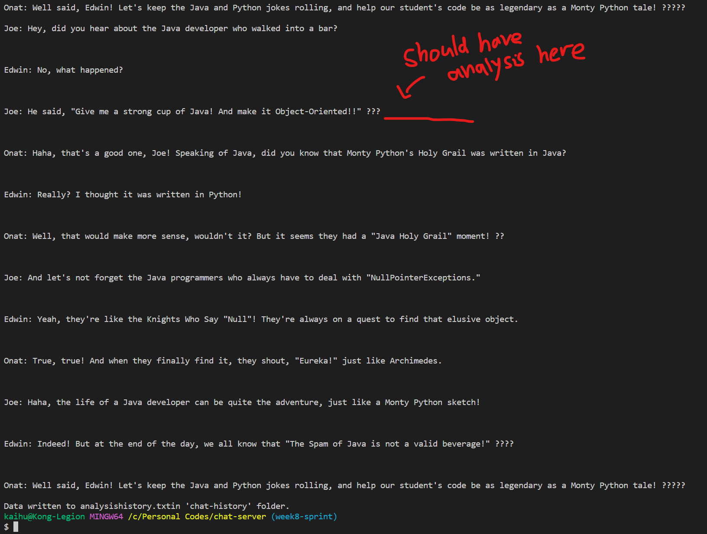

# Lab Report 5 - Felipe Kai Hu

This is the fifth lab report for CSE 15L FA23.
In this report, I'll be designing a debugging scenario between a student and a TA.

## Part 1 - Debugging Scenario

### Original post by student

> Hi, I'm having trouble with a modification of week 8's lab exercise. I'm trying to save the result of a semantic analysis into the chat history itself, so that the it can be saved into a file right after using a curl call to the `/save` path. But the semantic analysis function seems to have stopped working, and is not outputting anything to the page. I don't think I have changed anything that could have affected its functionality, but I'm not sure. Can you help me figure out what's wrong?

### Original code by student

```javascript
import java.io.IOException;
import java.net.URI;
import java.io.BufferedWriter;
import java.io.File;
import java.io.FileWriter;

class ChatHandler implements URLHandler {
  String chatHistory = "";

  public String handleRequest(URI url) {

    // expect /chat?user=<name>&message=<string>
    if (url.getPath().equals("/chat")) {
      String[] params = url.getQuery().split("&");
      String[] shouldBeUser = params[0].split("=");
      String[] shouldBeMessage = params[1].split("=");
      if (shouldBeUser[0].equals("user") && shouldBeMessage[0].equals("message")) {
        String user = shouldBeUser[1];
        String message = shouldBeMessage[1];
        this.chatHistory += user + ": " + message + "\n\n";
        return this.chatHistory;
      } else {
        return "Invalid parameters: " + String.join("&", params);
      }
    }
    else if (url.getPath().equals("/")){
      return this.chatHistory;
    }
    // expect /retrieve-history?file=<name>
    else if (url.getPath().equals("/retrieve-history")) {
      String[] params = url.getQuery().split("&");
      String[] shouldBeFile = params[0].split("=");
      if (shouldBeFile[0].equals("file")) {
        String fileName = shouldBeFile[1];
        ChatHistoryReader reader = new ChatHistoryReader();
        try {
          String[] contents = reader.readFileAsArray("chathistory/" + fileName);
          for (String line : contents) {
            this.chatHistory += line + "\n\n";
          }
        } catch (IOException e) {
          System.err.println("Error reading file: " + e.getMessage());
        }
      }
      return this.chatHistory;
    }
    // expect /save?name=<name>
    else if (url.getPath().equals("/save")) {
      String[] params = url.getQuery().split("&");
      String[] shouldBeFileName = params[0].split("=");
      if (shouldBeFileName[0].equals("name")) {
        File directory = new File("chathistory");
        File file = new File(directory, shouldBeFileName[1]);

        try (BufferedWriter writer = new BufferedWriter(new FileWriter(file))) {
          writer.write(this.chatHistory);
          return "Data written to " + shouldBeFileName[1] + "in 'chat-history' folder.";
        } catch (IOException e) {
          e.printStackTrace();
          return "Error: Something wrong happen during file save, check StackTrace";
        }
      }
    }
    // expect /semantic-analysis?user=<name>
    else if (url.getPath().equals("/semantic-analysis")) {
      String[] params = url.getQuery().split("&");
      String[] shouldBeUser = params[0].split("=");
      if (shouldBeUser[0].equals("user")) {
        String[] chatHistoryArr = this.chatHistory.split("\n\n");
        int index = 0;
        while (index < chatHistoryArr.length) {
          String line = chatHistoryArr[index];
          int numberOfExclamationMarks = 0;
          String analysis = "";
          int[] codePoints = new int[0];
          if (line.contains(shouldBeUser[1]))
          codePoints = line.codePoints().toArray();
          int characterIndex = 0;
          while (characterIndex < codePoints.length) {
            int character = codePoints[characterIndex];
            if (character == (int) '!') {
              numberOfExclamationMarks += 1;
            }
            if (new String(Character.toChars(character)).equals("😂")) {
              System.out.println("found");
              analysis = " This message has a LOL vibe.";
            }
            if (new String(Character.toChars(character)).equals("🥹")) {
              analysis = " This message has a awwww vibe.";
            }
            characterIndex += 1;
          }
          if (numberOfExclamationMarks > 2) {
            analysis += " This message ends forcefully.";
          }
          chatHistoryArr[index] += analysis;
          index += 1;
        }
      }
      return this.chatHistory;
    }
    return "404 Not Found";
  }

}

class ChatServer {
  public static void main(String[] args) throws IOException {
    int port = Integer.parseInt(args[0]);
    Server.start(port, new ChatHandler());
  }
}
```

### Original bash script by student

startServer.sh
```bash
javac ChatServer.java ChatHistoryReader.java Server.java
java ChatServer 8080
```

testServer.sh
```bash
curl localhost:8080/retrieve-history?file=chathistory1.txt

curl localhost:8080/semantic-analysis?user=Joe

curl localhost:8080/save?name=analysishistory.txt
```

### Original code output




(ps: I'm not sure why the emoji is not showing up in the terminal, probably a Windows thing)

### TA's response

> Hi, I have looked at your code and I think you should review the code for the `/semantic-analysis` path. How is the `chatHistoryArr` variable being used? What happens to `this.chatHistory` when `chatHistoryArr` is modified? Consider adding some print statements to see what is happening to the variables as the code is executed. Best of luck!

### Student's response

> Hi, thanks for the response. I think I have found the problem. It seems that the `chatHistoryArr` variable is being modified, but the `this.chatHistory` variable is not being updated. I think I need to update the `this.chatHistory` variable after modifying `chatHistoryArr`. I added a line of code to save `chatHistoryArr` back into `this.chatHistory` and it seems to be working now. Thanks for the help!

### Student's updated code

```javascript
import java.io.IOException;
import java.net.URI;
import java.io.BufferedWriter;
import java.io.File;
import java.io.FileWriter;

class ChatHandler implements URLHandler {
  String chatHistory = "";

  public String handleRequest(URI url) {

    // expect /chat?user=<name>&message=<string>
    if (url.getPath().equals("/chat")) {
      String[] params = url.getQuery().split("&");
      String[] shouldBeUser = params[0].split("=");
      String[] shouldBeMessage = params[1].split("=");
      if (shouldBeUser[0].equals("user") && shouldBeMessage[0].equals("message")) {
        String user = shouldBeUser[1];
        String message = shouldBeMessage[1];
        this.chatHistory += user + ": " + message + "\n\n";
        return this.chatHistory;
      } else {
        return "Invalid parameters: " + String.join("&", params);
      }
    }
    else if (url.getPath().equals("/")){
      return this.chatHistory;
    }
    // expect /retrieve-history?file=<name>
    else if (url.getPath().equals("/retrieve-history")) {
      String[] params = url.getQuery().split("&");
      String[] shouldBeFile = params[0].split("=");
      if (shouldBeFile[0].equals("file")) {
        String fileName = shouldBeFile[1];
        ChatHistoryReader reader = new ChatHistoryReader();
        try {
          String[] contents = reader.readFileAsArray("chathistory/" + fileName);
          for (String line : contents) {
            this.chatHistory += line + "\n\n";
          }
        } catch (IOException e) {
          System.err.println("Error reading file: " + e.getMessage());
        }
      }
      return this.chatHistory;
    }
    // expect /save?name=<name>
    else if (url.getPath().equals("/save")) {
      String[] params = url.getQuery().split("&");
      String[] shouldBeFileName = params[0].split("=");
      if (shouldBeFileName[0].equals("name")) {
        File directory = new File("chathistory");
        File file = new File(directory, shouldBeFileName[1]);

        try (BufferedWriter writer = new BufferedWriter(new FileWriter(file))) {
          writer.write(this.chatHistory);
          return "Data written to " + shouldBeFileName[1] + "in 'chat-history' folder.";
        } catch (IOException e) {
          e.printStackTrace();
          return "Error: Something wrong happen during file save, check StackTrace";
        }
      }
    }
    // expect /semantic-analysis?user=<name>
    else if (url.getPath().equals("/semantic-analysis")) {
      String[] params = url.getQuery().split("&");
      String[] shouldBeUser = params[0].split("=");
      if (shouldBeUser[0].equals("user")) {
        String[] chatHistoryArr = this.chatHistory.split("\n\n");
        int index = 0;
        while (index < chatHistoryArr.length) {
          String line = chatHistoryArr[index];
          int numberOfExclamationMarks = 0;
          String analysis = "";
          int[] codePoints = new int[0];
          if (line.contains(shouldBeUser[1]))
          codePoints = line.codePoints().toArray();
          int characterIndex = 0;
          while (characterIndex < codePoints.length) {
            int character = codePoints[characterIndex];
            if (character == (int) '!') {
              numberOfExclamationMarks += 1;
            }
            if (new String(Character.toChars(character)).equals("😂")) {
              System.out.println("found");
              analysis = " This message has a LOL vibe.";
            }
            if (new String(Character.toChars(character)).equals("🥹")) {
              analysis = " This message has a awwww vibe.";
            }
            characterIndex += 1;
          }
          if (numberOfExclamationMarks > 2) {
            analysis += " This message ends forcefully.";
          }
          chatHistoryArr[index] += analysis;
          index += 1;
        }
        this.chatHistory = String.join("\n\n", chatHistoryArr);
      }
      return this.chatHistory;
    }
    return "404 Not Found";
  }

}

class ChatServer {
  public static void main(String[] args) throws IOException {
    int port = Integer.parseInt(args[0]);
    Server.start(port, new ChatHandler());
  }
}
```

### Student's updated bash script

(The student did not update the bash script)

### Student's updated code output


## Part 2 - Reflection

I think that the most significant thing I have learned in this second half of the course is how to use VIM and its commands. I have always used nano to edit files remotely, since I had trouble understanding what was happening in VIM (I just pressed random buttons until it let me type). The fact that there are so many commands in VIM that can be used to make edits without even entering the insert mode is very cool!